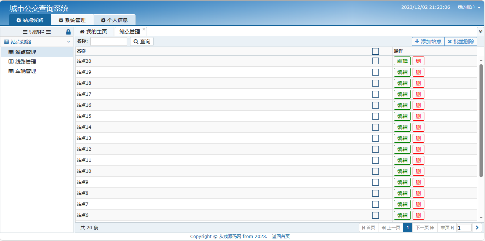
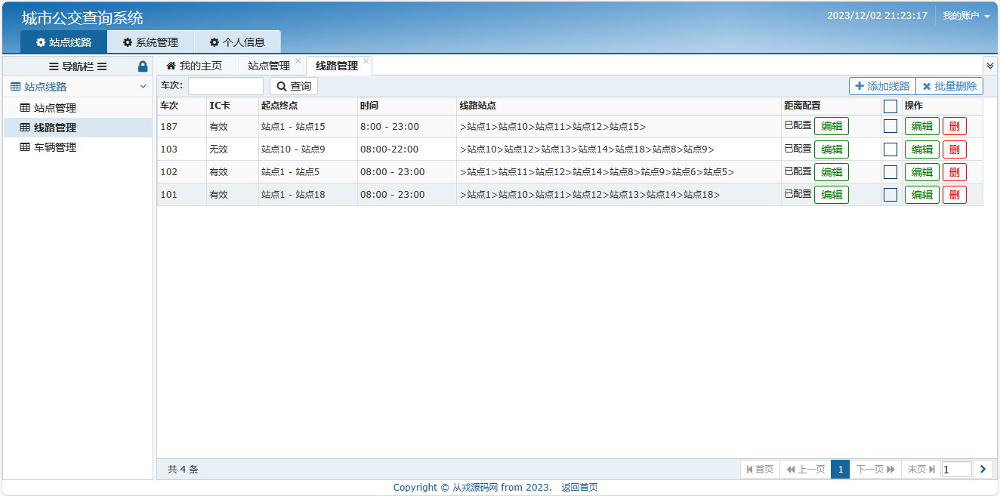
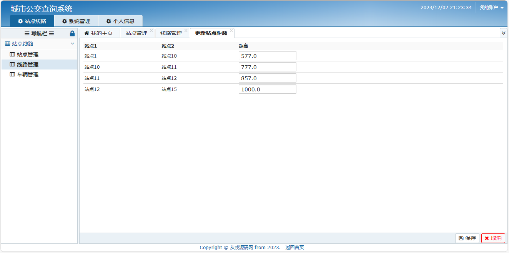
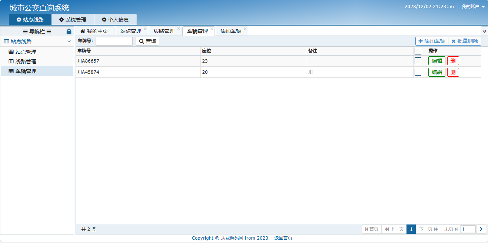
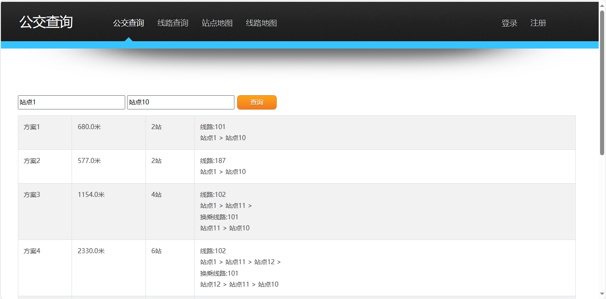
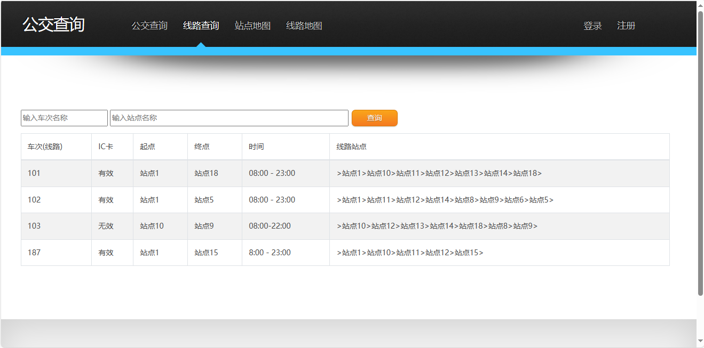
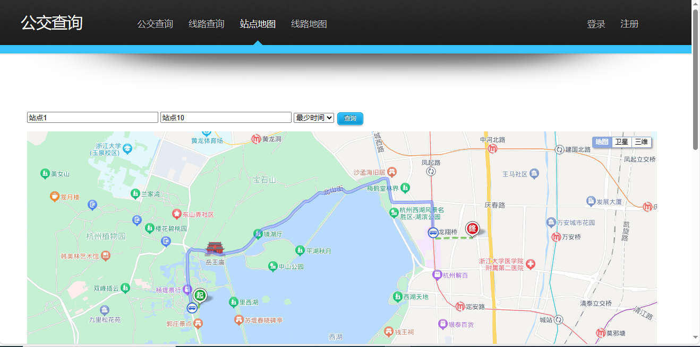

<h1 align="center">47.基于ssh的城市公交查询管理系统</h1>

 获取sql文件 QQ: 386869957 QQ群: 377586148 

 [推荐站点: 从戎源码网](https://armycodes.com/) 

## 简介
> 本代码来源于网络,仅供学习参考使用!
> 
> 前台页面：http://localhost:8080/com/gongjiao.action
> 
> 登录地址：http://localhost:8080/index.jsp
> 
> 管理员：admin 123456
> 用户：user 123456
> 

## 项目介绍
基于ssh的城市公交查询管理系统：前端jsp、jquery、bjui，后端 struts、spring、hibernate，集成公交查询、线路查询、站点地图、线路地图等功能于一体的系统。

## 功能介绍

### 用户

- 基本功能：登录、注册、退出、个人资料查看、个人资料修改
- 公交查询：从发点-终点查询、线路查询结果
- 线路查询：车次名称查询、站点名称查询、车次线路列表
- 站点地图：从发点-终点查询、地图上展示结果、地图上路径规划的曲线
- 线路地图：输入线路查询、地图显示线路和站点信息
- 投诉建议：投诉信息提交

### 管理员

- 站点管理：站点列表、站点名称搜索、站点信息修改、站点信息删除、添加站点、批量删除
- 线路管理：车次搜索记录、线路列表、线路信息修改、线路删除、添加线路、批量删除、距离配置
- 车辆管理：车辆列表、车牌号搜索车辆信息、添加车辆、删除、批量删除
- 用户管理：添加用户、用户列表、用户编辑、用户删除、批量删除、账号和姓名搜索记录

## 环境

- <b>IntelliJ IDEA 2009.3</b>

- <b>Mysql 5.7.26</b>

- <b>Tomcat 7.0.73</b>

- <b>JDK 1.8</b>

## 运行截图

